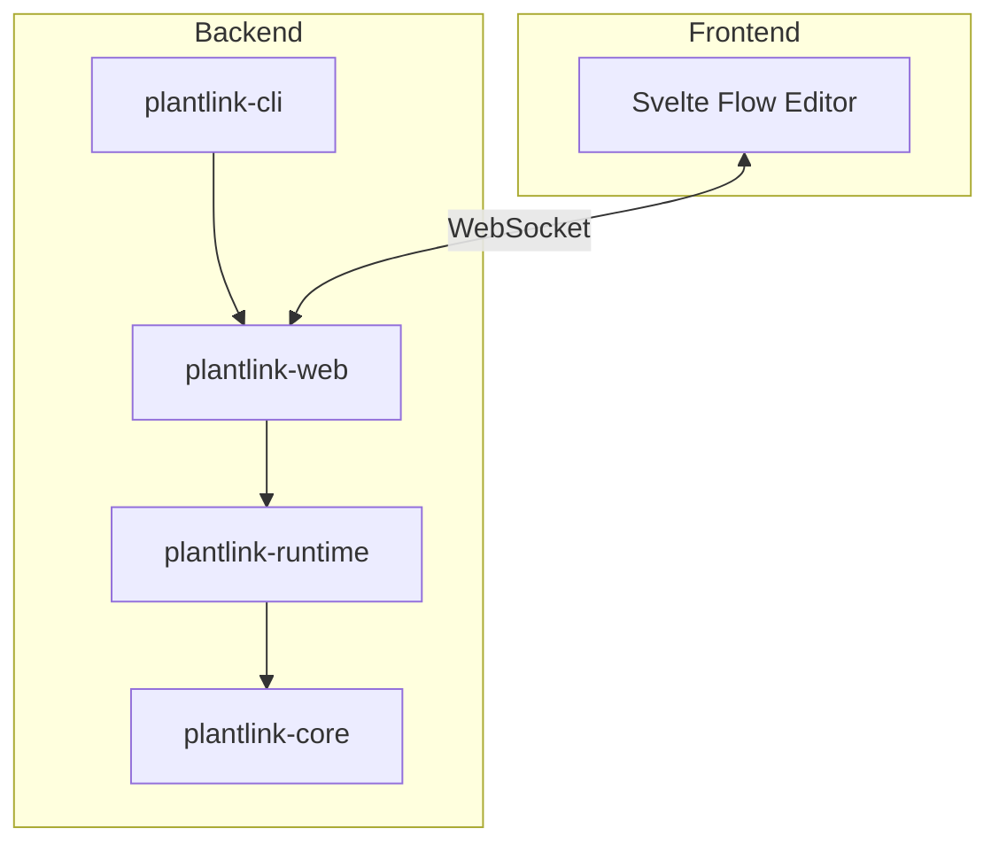

# PlantLink

**PlantLink** is a flow-based programming environment designed for IoT and Industrial Automation, built with performance and reliability in mind using **Rust**.


## Architecture Overview



## Features

-   **High-Performance Runtime**: Powered by Rust and Tokio for efficient, asynchronous message processing.
-   **Modern Flow Editor**: A beautiful, dark-mode enabled visual editor built with Svelte Flow.
-   **Scripting Support**: Integrated **Rhai** scripting engine for custom logic with a familiar syntax.
-   **Industrial Protocols**:
    -   **MQTT**: Publish and Subscribe support.
    -   **Modbus TCP**: Read Holding Registers.
    -   **NATS**: High-performance messaging integration.
-   **Developer Experience**:
    -   Hot-reload development workflow.
    -   Single-binary release capability.

## Example: Rhai Function

Create a simple flow that transforms an input message using the Rhai scripting engine.

**Flow**: `Inject` → `Function` → `Console`

1. **Inject Node**: Set payload to `Hello`
2. **Function Node**: Add the following Rhai script:
   ```rhai
   // msg.payload contains the input ("Hello")
   msg.payload = msg.payload + " World";
   return msg;
   ```
3. **Console Node**: Receives and logs the transformed message

**Output**: `Hello World`

## Getting Started

### Prerequisites
-   **Rust**: Stable toolchain installed (latest).
-   **Node.js**: v20+ (for UI build).

### Development
To run the full stack (UI + Backend) in development mode:
```bash
make run
```
This will build the UI assets and launch the `plantlink-cli`.

### Building for Release
To create a single, optimized binary with embedded assets:
```bash
make build-release
```
The binary will be located at `target/release/plantlink-cli`.

### Cleanup
To clean up build artifacts and logs:
```bash
make clean
```

## Architecture
-   **plantlink-core**: Shared data types and protocol definitions.
-   **plantlink-runtime**: The engine that executes the flow logic.
-   **plantlink-web**: Axum-based web server and WebSocket handler.
-   **plantlink-cli**: The command-line entry point.
-   **ui**: SvelteKit/Vite frontend application.

## Project Structure

```
plantlink/
├── plantlink-cli/          # CLI entry point
├── plantlink-core/         # Shared types (MessagePayload, DataValue)
├── plantlink-runtime/      # Flow execution engine
│   └── src/nodes/          # Node implementations (Rhai, NATS, etc.)
├── plantlink-web/          # Web server (Axum)
├── ui/                     # Svelte frontend
│   └── src/lib/
│       ├── nodeDefinitions.js   # Node registry (single source of truth)
│       ├── nodes/               # Node components
│       └── stores/              # Svelte stores
└── docs/                   # Documentation
```

## Documentation

-   **[Architecture](./docs/ARCHITECTURE.md)**: System overview, data flow, and design decisions.
-   **[Adding Nodes](./docs/ADDING_NODES.md)**: Step-by-step guide for developers creating new node types.
-   **[Rhai Scripting](./docs/RHAI_SCRIPTING.md)**: Guide for writing Rhai scripts in Function nodes.
-   **[API Reference](./docs/API.md)**: REST endpoints, WebSocket messages, and flow config format.
-   **[Theming](./docs/THEMING.md)**: UI theming system with CSS custom properties and semantic classes.
-   **[UI Testing](./docs/UI_TESTING.md)**: End-to-end testing guide with Playwright for preventing regressions.

## License
MIT
