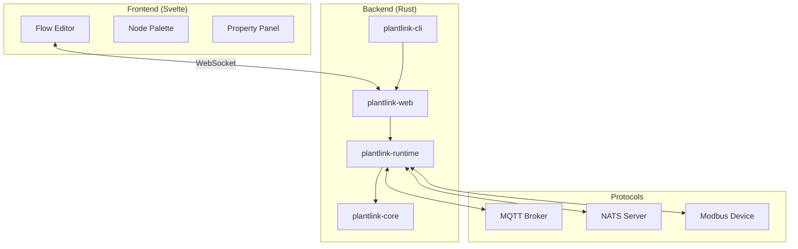
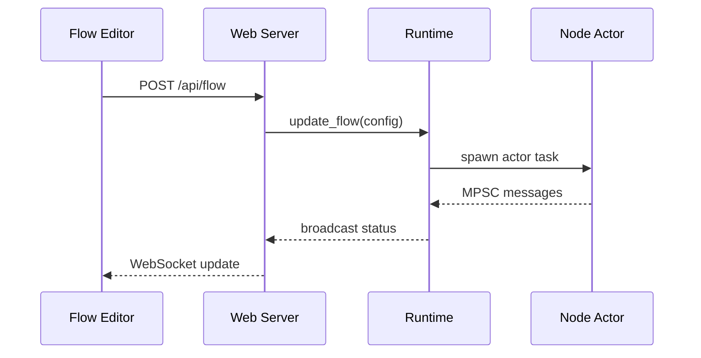

# PlantLink Architecture

> **Technical Source of Truth** — See `GEMINI.md` for operational rules.

## 1. Project Overview
PlantLink is a flow-based programming environment designed for IoT and Industrial Automation. It enables users to create complex automation flows by connecting nodes representing protocols, logic, and external services. The system is built for performance, reliability, and extensibility in industrial environments.

## 2. Project Objectives & Key Features
- **Primary Objectives**: Flow-based IoT programming, protocol integration, real-time monitoring, extensible node system
- **Key Features**: Visual flow editor, Rhai scripting, MQTT/NATS/Modbus protocol nodes, WebSocket live status
- **Target Users**: Industrial IoT engineers, automation integrators
- **Non-Goals**: Cloud hosting, user authentication, multi-tenancy

## 3. Language & Runtime
- **Backend**: Rust (Edition 2024) utilizing the `tokio` async runtime for high-concurrency actor-based node execution.
- **Frontend**: Svelte 5 + Vite 7 + TailwindCSS 3, providing a modern, responsive flow editor.
- **Scripting**: Rhai 1.16 for user-defined logic within nodes, offering a safe and familiar syntax embedded in Rust.
- **Environment**: Node.js v20+ for frontend development and tooling.

## 4. Project Layout
The project is structured as a Rust multi-crate workspace:

| Directory | Component | Purpose |
|:---|:---|:---|
| `plantlink-cli/` | CLI | Orchestration entry point, bootstraps runtime and web server. |
| `plantlink-web/` | Web Server | Axum-based HTTP server, WebSocket state, and embedded UI assets. |
| `plantlink-runtime/` | Runtime Engine | Flow execution engine, node orchestration, and Rhai integration. |
| `plantlink-core/` | Core Library | Shared data types (`MessagePayload`, `DataValue`) and protocol traits. |
| `ui/` | Frontend | SvelteKit-based flow editor. |
| `scripts/` | Tooling | Maintenance and verification scripts (e.g., `verify.sh`). |
| `docs/` | Documentation | Feature-specific guides and reference material. |

## 5. Toolchain
All workflows are orchestrated via the root `Makefile`:

- **Formatter**: `cargo fmt` (Checked via `cargo fmt --all -- --check`)
- **Linter**: `cargo clippy --all-targets --all-features -- -D warnings`
- **Unit Tests**: `cargo test --all-features`
- **Build Check**: `cargo check`
- **UI E2E Tests**: `cd ui && npm run test:e2e` (Playwright)
- **Full Quality Gate**: `make verify` (Runs `./scripts/verify.sh`)

### Workspace Linting
All crates inherit shared lint rules from the root `Cargo.toml` via `[workspace.lints]` + per-crate `[lints] workspace = true`. Key rules:

| Rule / Group | Level | Rationale |
|:---|:---|:---|
| `clippy::all` | **deny** | Baseline correctness gate |
| `clippy::pedantic` | **warn** | Encourage idiomatic Rust |
| `clippy::missing_errors_doc` | **deny** | All `Result`-returning fns must document `# Errors` |
| `clippy::missing_panics_doc` | **deny** | All panicking paths must be documented |
| `clippy::undocumented_unsafe_blocks` | **deny** | No silent `unsafe` |
| `clippy::cast_possible_truncation` | **deny** | Prevent silent data loss in casts |
| `clippy::large_futures` | **deny** | Guard against oversized future allocations |
| `clippy::module_name_repetitions` | **allow** | Permits `NodeConfig` inside `nodes::` module |
| `clippy::must_use_candidate` | **allow** | Reduces noise on builder-pattern APIs |
| `rust::unsafe_code` | **warn** | Discourage but don't block `unsafe` |

## 6. Module Boundaries
- **plantlink-core**: Owns shared types (`DataValue`, `MessagePayload`), protocol driver structs. Does NOT own node logic or HTTP.
  - **Trait Interfaces**: None (concrete structs only).
  - **Mock Availability**: None — protocols are concrete.
- **plantlink-runtime**: Owns flow execution (`RuntimeEngine`), node lifecycle, node registry. Does NOT own HTTP endpoints or CLI parsing.
  - **Trait Interfaces**: `NodeBehavior`, `SimpleNode`, `BaseNodeAdapter` (adapter).
  - **Mock Availability**: Testable via concrete node instances.
  - **Key patterns**: Global `NodeRegistry` (factory map), `BaseNodeAdapter` (adapter), `CancellationToken` (cooperative shutdown).
- **plantlink-web**: Owns REST API, WebSocket handler, embedded UI assets. Does NOT own flow logic or protocol drivers.
  - **Trait Interfaces**: None — thin HTTP layer.
  - **Mock Availability**: N/A.
- **plantlink-cli**: Owns bootstrapping (tracing, tokio runtime, CLI args). Does NOT own any business logic.
  - **Trait Interfaces**: None.
  - **Mock Availability**: N/A.

## 7. Dependency Direction Rules
| Module | May Import | Must NOT Import |
|--------|-----------|-----------------|
| `plantlink-cli` | `web`, `runtime`, `core` | — (top-level entry) |
| `plantlink-web` | `runtime`, `core` | `cli` |
| `plantlink-runtime` | `core` | `cli`, `web` |
| `plantlink-core` | (external crates only) | `cli`, `web`, `runtime` |

## 8. Error Handling Strategy
- **Library/Domain Errors**: `plantlink-core` declares `thiserror` as a dependency
  but does not currently define structured error types. All error handling uses
  `anyhow::Result`. Structured errors are a future improvement.
- **Application Errors**: `anyhow` is used in the binary crates (`cli`, `web`, `runtime`) for flexible error propagation and context wrapping.
- **Pattern**: Functions return `Result<T, anyhow::Error>` for broad compatibility across the workspace.

## 9. Observability & Logging
- **Framework**: `tracing` is used throughout the backend for structured logging and instrumentation.
- **Subscribers**: `tracing-subscriber` in `plantlink-cli` configures output formatting and log levels.
- **Levels**: standard `ERROR`, `WARN`, `INFO`, `DEBUG`, and `TRACE` used per `GEMINI.md` guidelines.

## 10. Concurrency Model
- **Actor-per-node**: Each node is spawned as an independent `tokio::spawn` task.
- **Inter-node channels**: Bounded `mpsc` channels (capacity: 100) carry `(port_idx, MessagePayload)` tuples.
- **Source nodes**: Nodes with no input receivers are kept alive via `futures::future::pending()`.
- **Stream multiplexing**: Nodes with multiple inputs use `tokio_stream::StreamMap` to merge all receivers.
- **Cooperative shutdown**: `CancellationToken` (from `tokio-util`) is propagated from `RuntimeEngine` to all child tasks.

## 11. State Management
- **Shared resource registry**: `Arc<RwLock<HashMap<String, Box<dyn Any + Send + Sync>>>>` scoped per flow execution. Allows nodes to share typed state (e.g., protocol connections).
- **System event bus**: `broadcast::Sender<String>` carries JSON-serialized status and log events from nodes to the WebSocket layer.

## 12. Testing Strategy
- **Unit Testing**: Rust unit tests are co-located in `src/` modules.
- **E2E Testing**: Playwright is used in the `ui/` directory to validate full-stack flows via Chromium.
- **Continuous Verification**: `scripts/verify.sh` ensures all code passes formatting, linting, and testing before commit.

## 13. Documentation Conventions
- **Rustdoc**: Triple-slash (`///`) comments for public types, traits, and functions.
- **Module Documentation**: Inline (`//!`) comments at the top of crate roots.
- **Frontend**: JSDoc-style comments for complex Svelte components and utility functions.

## 14. Dependencies & External Systems
Primary external integrations:
- **MQTT**: `rumqttc` for asynchronous broker communication.
- **NATS**: `async-nats` for high-performance messaging.
- **Modbus**: `tokio-modbus` (TCP) for industrial device interoperability.
- **Protocols**: All drivers reside in `plantlink-core` or are orchestrated by `plantlink-runtime`.

## 15. Architecture Diagrams

### System Overview

### Data Flow

## 16. Known Constraints & Bugs
- **Environment**: Must run in Windows non-admin space using BusyBox/PowerShell.
- **Deployment**: Single-binary release capability with embedded assets requires `rust-embed` in `plantlink-web`.
- **Status Reporting**: Centrally managed via `plantlink_runtime::nodes::send_node_status`.
- **MQTT Reconnection**: `MqttDriver` event loop uses exponential backoff (1s–60s) on connection errors. Reconnection is handled by `rumqttc` internally; the driver logs warnings but never panics.
- **Channel Error Propagation**: `NodeContext::send_output` and `send_output_port` return `Result<()>`. Callers must handle or propagate downstream channel failures.
