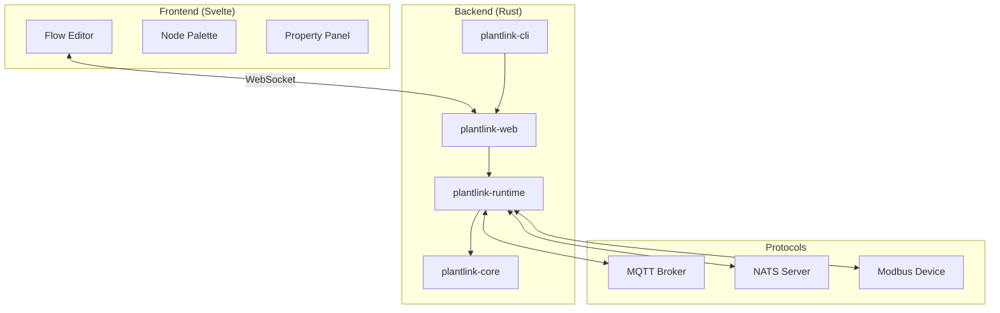
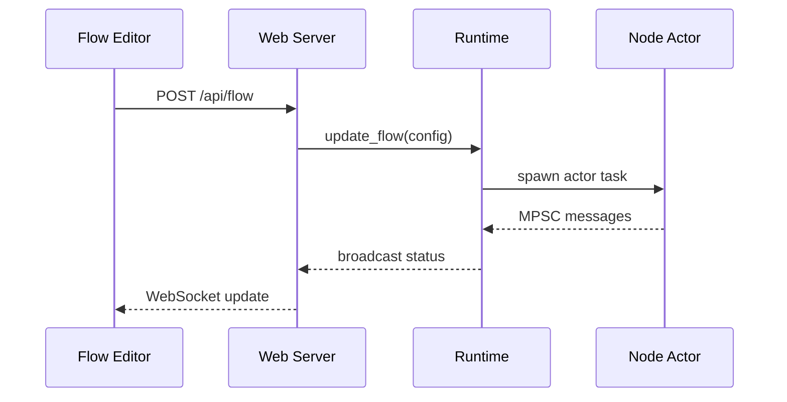

# PlantLink Architecture

> **Technical Source of Truth** — See `GEMINI.md` for operational rules.

## 1. Project Overview
PlantLink is a flow-based programming environment designed for IoT and Industrial Automation. It enables users to create complex automation flows by connecting nodes representing protocols, logic, and external services. The system is built for performance, reliability, and extensibility in industrial environments.

## 2. Language & Runtime
- **Backend**: Rust (Edition 2024) utilizing the `tokio` async runtime for high-concurrency actor-based node execution.
- **Frontend**: Svelte 5 + Vite 7 + TailwindCSS 3, providing a modern, responsive flow editor.
- **Scripting**: Rhai 1.16 for user-defined logic within nodes, offering a safe and familiar syntax embedded in Rust.
- **Environment**: Node.js v20+ for frontend development and tooling.

## 3. Project Layout
The project is structured as a Rust multi-crate workspace:

| Directory | Component | Purpose |
|:---|:---|:---|
| `plantlink-cli/` | CLI | Orchestration entry point, bootstraps runtime and web server. |
| `plantlink-web/` | Web Server | Axum-based HTTP server, WebSocket state, and embedded UI assets. |
| `plantlink-runtime/` | Runtime Engine | Flow execution engine, node orchestration, and Rhai integration. |
| `plantlink-core/` | Core Library | Shared data types (`MessagePayload`, `DataValue`) and protocol traits. |
| `ui/` | Frontend | SvelteKit-based flow editor. |
| `scripts/` | Tooling | Maintenance and verification scripts (e.g., `verify.sh`). |
| `docs/` | Documentation | Feature-specific guides and reference material. |

## 4. Toolchain
All workflows are orchestrated via the root `Makefile`:

- **Formatter**: `cargo fmt` (Checked via `cargo fmt -- --check`)
- **Linter**: `cargo clippy -- -D warnings`
- **Unit Tests**: `cargo test`
- **Build Check**: `cargo check`
- **UI E2E Tests**: `cd ui && npm run test:e2e` (Playwright)
- **Full Quality Gate**: `make verify` (Runs `./scripts/verify.sh`)

## 5. Error Handling Strategy
- **Library/Domain Errors**: `plantlink-core` uses `thiserror` to define explicit, structured error types for protocol drivers and core logic.
- **Application Errors**: `anyhow` is used in the binary crates (`cli`, `web`, `runtime`) for flexible error propagation and context wrapping.
- **Pattern**: Functions return `Result<T, anyhow::Error>` for broad compatibility across the workspace.

## 6. Observability & Logging
- **Framework**: `tracing` is used throughout the backend for structured logging and instrumentation.
- **Subscribers**: `tracing-subscriber` in `plantlink-cli` configures output formatting and log levels.
- **Levels**: standard `ERROR`, `WARN`, `INFO`, `DEBUG`, and `TRACE` used per `GEMINI.md` guidelines.

## 7. Testing Strategy
- **Unit Testing**: Rust unit tests are co-located in `src/` modules.
- **E2E Testing**: Playwright is used in the `ui/` directory to validate full-stack flows via Chromium.
- **Continuous Verification**: `scripts/verify.sh` ensures all code passes formatting, linting, and testing before commit.

## 8. Documentation Conventions
- **Rustdoc**: Triple-slash (`///`) comments for public types, traits, and functions.
- **Module Documentation**: Inline (`//!`) comments at the top of crate roots.
- **Frontend**: JSDoc-style comments for complex Svelte components and utility functions.

## 9. Dependencies & External Systems
Primary external integrations:
- **MQTT**: `rumqttc` for asynchronous broker communication.
- **NATS**: `async-nats` for high-performance messaging.
- **Modbus**: `tokio-modbus` (TCP) for industrial device interoperability.
- **Protocols**: All drivers reside in `plantlink-core` or are orchestrated by `plantlink-runtime`.

## 10. Architecture Diagrams

### System Overview

### Data Flow

## 11. Known Constraints & Bugs
- **Environment**: Must run in Windows non-admin space using BusyBox/PowerShell.
- **Deployment**: Single-binary release capability with embedded assets requires `rust-embed` in `plantlink-web`.
- **Status Reporting**: Centrally managed via `plantlink_runtime::nodes::send_node_status`.
