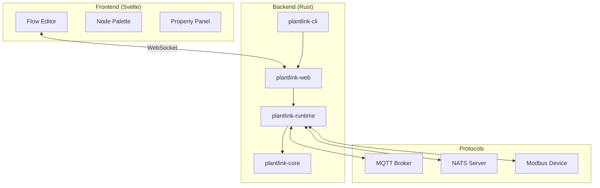
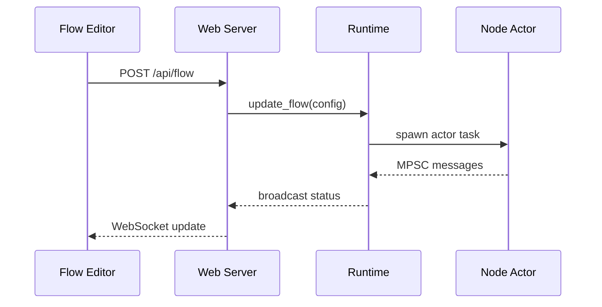

# PlantLink Architecture

> **Technical Source of Truth** — See `GEMINI.md` for operational rules.

## 1. Project Overview
PlantLink is a flow-based programming environment designed for IoT and Industrial Automation. It enables users to create complex automation flows by connecting nodes representing protocols, logic, and external services. The system is built for performance, reliability, and extensibility in industrial environments.

## 2. Project Objectives & Key Features
- **Primary Objectives**: Flow-based IoT programming, protocol integration, real-time monitoring, extensible node system
- **Key Features**: Visual flow editor, Rhai scripting, MQTT/NATS/Modbus protocol nodes, WebSocket live status
- **Target Users**: Industrial IoT engineers, automation integrators
- **Non-Goals**: Cloud hosting, user authentication, multi-tenancy

## 3. Language & Runtime
- **Backend**: Rust (Edition 2024) utilizing the `tokio` async runtime for high-concurrency actor-based node execution.
- **Frontend**: Svelte 5 + Vite 7 + TailwindCSS 3, providing a modern, responsive flow editor.
- **Scripting**: Rhai 1.16 for user-defined logic within nodes, offering a safe and familiar syntax embedded in Rust.
- **Environment**: Node.js v20+ for frontend development and tooling.

## 4. Project Layout
The project is structured as a Rust multi-crate workspace:

| Directory | Component | Purpose |
|:---|:---|:---|
| `plantlink-cli/` | CLI | Orchestration entry point, bootstraps runtime and web server. |
| `plantlink-web/` | Web Server | Axum-based HTTP server, WebSocket state, and embedded UI assets. |
| `plantlink-runtime/` | Runtime Engine | Flow execution engine, node orchestration, and Rhai integration. |
| `plantlink-core/` | Core Library | Shared data types (`MessagePayload`, `DataValue`) and protocol traits. |
| `ui/` | Frontend | SvelteKit-based flow editor. |
| `scripts/` | Tooling | Maintenance and verification scripts (e.g., `verify.sh`). |
| `docs/` | Documentation | Feature-specific guides and reference material. |

## 5. Module Boundaries
- **plantlink-core**: Owns shared types (`DataValue`, `MessagePayload`), protocol driver structs. Does NOT own node logic or HTTP.
  - **Trait Interfaces**: `PubSubClient`, `ModbusClient`.
  - **Mock Availability**: Mockable via `MockPubSubClient` and `MockModbusClient`.
- **plantlink-runtime**: Owns flow execution (`RuntimeEngine`), node lifecycle, node registry. Does NOT own HTTP endpoints or CLI parsing.
  - **Trait Interfaces**: `FlowRuntime`, `NodeBehavior`, `SimpleNode`, `BaseNodeAdapter` (adapter).
  - **Mock Availability**: `dyn FlowRuntime` allows mocking the entire engine. Testable via concrete node instances.
  - **Key patterns**: Instance-scoped `NodeRegistry` (not global), `BaseNodeAdapter` (adapter), `CancellationToken` (cooperative shutdown).
  - **Internal modules**:
    - `nodes::base` — `SimpleNode` trait and `BaseNodeAdapter` lifecycle wrapper.
    - `nodes::registry` — `NodeRegistry` factory and `NodeFactory` type alias.
    - `nodes::rhai` — Rhai scripting engine integration (`RhaiNode`).
    - `nodes::nats` — NATS broker, subscriber, and publisher nodes.
    - `nodes::inject` — Timer and trigger source node.
    - `nodes::console` — Debug output sink node.
- **plantlink-web**: Owns REST API, WebSocket handler, embedded UI assets. Does NOT own flow logic or protocol drivers.
  - **Trait Interfaces**: None — thin HTTP layer.
  - **Mock Availability**: Consumes `dyn FlowRuntime` for isolated endpoint testing.
- **plantlink-cli**: Owns bootstrapping (tracing, tokio runtime, CLI args). Does NOT own any business logic.
  - **Trait Interfaces**: None.
  - **Mock Availability**: N/A.

## 6. Dependency Direction Rules
| Module | May Import | Must NOT Import |
|--------|-----------|-----------------|
| `plantlink-cli` | `web`, `runtime`, `core` | — (top-level entry) |
| `plantlink-web` | `runtime`, `core` | `cli` |
| `plantlink-runtime` | `core` | `cli`, `web` |
| `plantlink-core` | (external crates only) | `cli`, `web`, `runtime` |

## 7. Toolchain
All workflows are orchestrated via the root `Makefile`:

- **Formatter**: `cargo fmt` (Checked via `cargo fmt --all -- --check`)
- **Linter**: `cargo clippy --all-targets --all-features -- -D warnings`
- **AST Linter**: `make lint-ast` (Runs `sg scan` for AST-aware structural rules)
- **Unit Tests**: `cargo test --all-features`
- **Build Check**: `cargo check`
- **UI E2E Tests**: `make test-integration` (Executes via `scripts/run-integration.ps1`)
- **Doc Coverage**: `make doc-coverage` (Checks public item doc coverage)
- **Doc Comments**: `make doc-comments` (Counts doc comment lines)
- **Git Diff**: `make diff-last` (Safe patch viewing without banned IDE characters)
- **MD Sections**: `make sections FILE=<file>` (Lists Markdown section headings safely)
- **Quality Gates**:
  - `make verify` (Standard 4-gate verification pipeline wrapper)
  - `make verify-full` (Extended pipeline integrating Playwright UI tests via `scripts/run-integration.ps1`)
- **Maintenance**:
  - `make check-stubs` (Detects unresolved stub assertions across the workspace)
  - `make todos` (Lists lingering TODO markers)
  - `make secrets` (Scans git index for leaked secrets)

### Workspace Linting
All crates inherit shared lint rules from the root `Cargo.toml` via `[workspace.lints]` + per-crate `[lints] workspace = true`. Key rules:

| Rule / Group | Level | Rationale |
|:---|:---|:---|
| `clippy::all` | **deny** | Baseline correctness gate |
| `clippy::pedantic` | **warn** | Encourage idiomatic Rust |
| `clippy::missing_errors_doc` | **deny** | All `Result`-returning fns must document `# Errors` |
| `clippy::missing_panics_doc` | **deny** | All panicking paths must be documented |
| `clippy::undocumented_unsafe_blocks` | **deny** | No silent `unsafe` |
| `clippy::cast_possible_truncation` | **deny** | Prevent silent data loss in casts |
| `clippy::large_futures` | **deny** | Guard against oversized future allocations |
| `clippy::module_name_repetitions` | **allow** | Permits `NodeConfig` inside `nodes::` module |
| `clippy::must_use_candidate` | **allow** | Reduces noise on builder-pattern APIs |
| `rust::unsafe_code` | **warn** | Discourage but don't block `unsafe` |

## 8. Error Handling Strategy
- **Library/Domain Errors**: `plantlink-core` defines the `PlantLinkError` enum using `thiserror`. All core traits ([`PubSubClient`], [`ModbusClient`][modbus-trait]) and drivers return `Result<T, PlantLinkError>`. This allows consumers to match on specific failure variants (e.g., `Connection`, `Publish`, `Subscribe`).
- **Application Errors**: `anyhow` is used in the binary crates (`cli`, `web`, `runtime`) for flexible error propagation and context wrapping. Since `PlantLinkError` implements `std::error::Error`, it is automatically converted to `anyhow::Error` via the `?` operator.
- **Invariants**: Every error must carry human-readable context. Variants are `#[non_exhaustive]` to support future protocol expansion.

## 9. Observability & Logging
- **Framework**: `tracing` is used throughout the backend for structured logging and instrumentation.
- **Subscribers**: `tracing-subscriber` in `plantlink-cli` configures output formatting and log levels.
- **Levels**: standard `ERROR`, `WARN`, `INFO`, `DEBUG`, and `TRACE` used per `GEMINI.md` guidelines.

## 10. Testing Strategy
- **Unit Testing**: Rust unit tests are co-located in `src/` modules.
- **E2E Testing**: Playwright is used to validate full-stack flows via Chromium. Tests are proxied through execution policies (`scripts/run-integration.ps1`) to reliably inject `PLANTLINK_AUTH_TOKEN` past Makefile variable scopes. Workers are strictly pinned (`workers: 1`) to ensure serial execution to prevent data collisions against the single shared live test backend instance.
- **Continuous Verification**: `make verify` and `make verify-full` ensures all code passes formatting, clippy linting, testing, E2E resilience, and AST structural rules deterministicly before commit.

## 11. Documentation Conventions
- **Rustdoc**: Triple-slash (`///`) comments for public types, traits, and functions.
- **Module Documentation**: Inline (`//!`) comments at the top of crate roots.
- **Frontend**: JSDoc-style comments for complex Svelte components and utility functions.

## 12. Dependencies & External Systems
Primary external integrations:
- **MQTT**: `rumqttc` for asynchronous broker communication.
- **NATS**: `async-nats` for high-performance messaging.
- **Modbus**: `tokio-modbus` (TCP) for industrial device interoperability.
- **Protocols**: All drivers reside in `plantlink-core` or are orchestrated by `plantlink-runtime`.

## 13. Architecture Diagrams

### System Overview

### Data Flow

## 14. Known Constraints & Technical Debt
- **Environment**: Must run in Windows non-admin space using BusyBox/PowerShell.
- **Deployment**: Single-binary release capability with embedded assets requires `rust-embed` in `plantlink-web`.
- **Status Reporting**: Centrally managed via `plantlink_runtime::nodes::send_node_status`.
- **Structured Shutdown**: `MqttDriver` uses a `CancellationToken` and `tokio::task::JoinHandle` to ensure the background event loop exits cleanly when the driver is dropped.
- **ISP Violation (Tech Debt)**: The `PubSubClient` trait combines `publish` and `subscribe`. Drivers like `MqttDriver` are forced to implement stubs for unsupported capabilities. Refactoring this into separate `Publisher`/`Subscriber` traits is planned for post-v1 stabilization.
- **Modbus Exclusivity**: Although previously a technical debt point bounded by `tokio::sync::Mutex` contention, `ModbusClient` now exclusively uses an overarching MPSC Actor model background task to ensure safety alongside zero-contention access across concurrent nodes.
- **Channel Error Propagation**: `NodeContext::send_output` and `send_output_port` return `Result<()>`. Callers must handle or propagate downstream channel failures.
- **Rhai Script Validation (Resolved)**: `NodeFactory` returns `Result<Box<dyn NodeBehavior>>`. `RhaiNode::new()` compiles scripts at node instantiation and propagates compilation errors at flow deployment time via `RuntimeEngine::update_flow`. Invalid scripts prevent deployment.
- **Protocol Integrations (High Value, Higher CI/CD Complexity)**: Our main selling point is IoT/SCADA connectivity. The current test suite doesn't actually test MQTT, NATS, or Modbus because we don't spin up brokers in the `Makefile`. *The Gap*: `spec.md` lists `MqttDriver`, `NatsDriver`, and `ModbusTcpClient` as needing integration test coverage. *The Tradeoff*: To test these in Playwright E2E or via `make test-integration`, we would need to run a local MQTT broker (e.g., Mosquitto) or NATS server during the pipeline. The decision to introduce `docker-compose` or `testcontainers-rs` into the verification gate vs keeping CI lightweight is pending.

## 15. Data Model
*N/A — PlantLink currently does not utilize persistent local database storage.* Flow states map to transient memory and protocol buses.

## 16. Environment Configuration
The system is designed for dynamic discovery and late-binding of connections:
- **Broker Discovery**: Endpoints for NATS and MQTT brokers are provided at runtime via the `FlowConfig` JSON payload, not static environment variables.
- **Secrets Management**: While the current MVP uses plaintext passwords in the `FlowConfig`, the architecture supports future integration with platform-native secrets managers by swapping the `PubSubClient` implementation.
- **Crate Environment**: `plantlink-web` looks for frontend assets in `../ui/dist` during development, or embedded within the binary in production mode.

---

## Appendix: Concurrency Model
- **Structured concurrency**: `RuntimeEngine` uses `tokio_util::task::TaskTracker` to formally track and await all background tasks (actors and timers) during flow shutdown.
- **Actor-per-node**: Each node is spawned as an independent task within the `TaskTracker`, implementing the `NodeBehavior` trait.
- **Inter-node channels**: Bounded `mpsc` channels (capacity: 100) carry `(port_idx, Arc<MessagePayload>)` tuples.
- **Reference-counted payloads**: All messages are wrapped in `Arc` by the `NodeContext::send_output` method to eliminate deep clones ($O(N)$ memory duplication) during multi-port fan-out.
- **Actor Interface**: Nodes implement the `receive` method (accepting `Arc<MessagePayload>`) for high-performance message handling.
- **Source nodes**: Nodes with no input receivers are kept alive via cancellation-aware wait loops.
- **Stream multiplexing**: Nodes with multiple inputs use `tokio_stream::StreamMap` to merge all receivers into a single event stream.
- **Cooperative shutdown**: `CancellationToken` and `TaskTracker` work in tandem to ensure graceful, deterministic exit of all asynchronous components.

## Appendix: State Management
- **Shared resource registry**: `Arc<RwLock<HashMap<String, Box<dyn Any + Send + Sync>>>>` scoped per flow execution. Allows nodes to share typed state (e.g., protocol connections).
- **System event bus**: `broadcast::Sender<SystemEvent>` carries strongly-typed JSON-serializable status and log events from nodes to the WebSocket layer.

## Appendix: Web Server Security & Concurrency
The `plantlink-web` component follows strict hardening patterns for remote deployment:
- **Authentication**: REST API endpoints (`/api/flow/*`) are protected by a Bearer token middleware. The secret is provided via the `PLANTLINK_AUTH_TOKEN` environment variable. If unset, authentication is disabled (development mode).
- **Structured Concurrency**: All background tasks, including the `EventCache` aggregator and individual WebSocket handlers, are managed by a `tokio_util::task::TaskTracker`. Deterministic shutdown is triggered via a `CancellationToken`.
- **WebSocket Heartbeats**: Active `Ping/Pong` heartbeats every 15 seconds prevent silent connection drops behind reverse proxies or stateful firewalls.
- **Broadcast Efficiency**: System events are pre-serialized into `Arc<String>` once by the server-side aggregator and broadcast to all WebSocket clients to eliminate redundant JSON overhead ($O(1)$ serialization).
