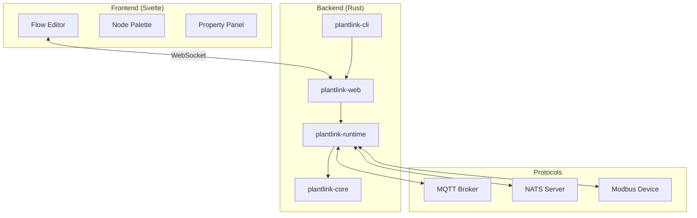
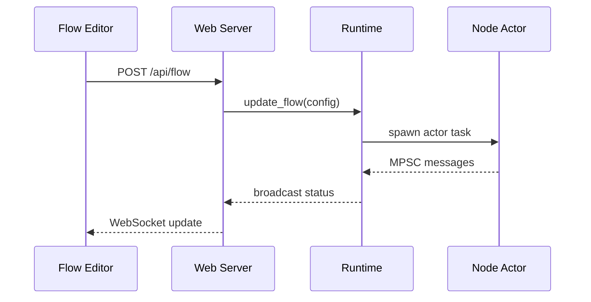

# PlantLink Architecture

Comprehensive system architecture documentation for PlantLink.

## System Overview



---

## Crate Breakdown

| Crate | Purpose |
|-------|---------|
| **plantlink-core** | Shared types: `DataValue`, `MessagePayload`, protocol drivers |
| **plantlink-runtime** | Flow execution engine, node behaviors, message routing |
| **plantlink-web** | Axum HTTP server, WebSocket handler, static file serving |
| **plantlink-cli** | CLI entry point, argument parsing, server startup |

---

## Data Flow



---

## Key Components

### Runtime Engine

- Manages node lifecycle (create, start, stop)
- Routes messages between nodes via MPSC channels
- Uses actor pattern: each node runs in its own Tokio task

### Node Behavior Trait

```rust
#[async_trait]
pub trait NodeBehavior: Send + Sync {
    async fn start(&mut self, ctx: NodeContext) -> Result<()> { Ok(()) }
    async fn on_input(&mut self, port: usize, msg: MessagePayload, ctx: NodeContext) -> Result<()> { Ok(()) }
    async fn stop(&mut self) -> Result<()> { Ok(()) }
}

### Node Lifecycle

Nodes transition through 3 states:

1. **Stopped** (Gray): Default state. Code is not running.
2. **Running** (Green): `start()` succeeded. `ctx.emit_running()` called.
3. **Error** (Red): Start failed or runtime error. `ctx.emit_error()` called.

Transitions:
- **Deploy**: All nodes clear status -> `start()` called -> emit `running` or `error`.
- **Stop**: `stop_flow()` called -> emit `stopped` -> tasks aborted.
- **Runtime Error**: `on_input()` fails -> emit `error`.
```

### Shared Resources

Connections (NATS, MQTT) stored in shared map:
```rust
Arc<RwLock<HashMap<String, Box<dyn Any + Send + Sync>>>>
```

### Unified Status Reporting

The system uses a centralized reporting mechanism to ensure UI state consistency:

1.  **Utility**: `plantlink_runtime::nodes::send_node_status` constructs standard JSON and broadcasts via the system channel.
2.  **Internal Usage**: `RuntimeEngine` uses the utility during bulk operations (e.g., stopping all nodes during flow deployment).
3.  **External Usage**: `NodeContext::emit_status` (and its helpers `emit_running`, `emit_stopped`, `emit_error`) wraps the utility for node-specific reporting.

---

## UI Architecture

| Component | Purpose |
|-----------|---------|
| `nodeDefinitions.js` | Single source of truth for node metadata |
| `NodePalette.svelte` | Auto-generated from definitions |
| `BaseNode.svelte` | Generic node component with auto-fetch |
| `InnerFlowEditor.svelte` | SvelteFlow canvas with connection validation |
| `PropertyPanel.svelte` | Dynamic property editing |

---

## Port Type System

```javascript
// Port definition in nodeDefinitions.js
{
    label: "Connection",
    type: "connection",        // Output type
    acceptTypes: ["connection"], // Accepted input types
    maxConnections: 1           // Single connection limit
}
```

**Types:**
- `connection` - Broker/driver connection IDs
- `message` - Data payloads (string, JSON, etc.)
