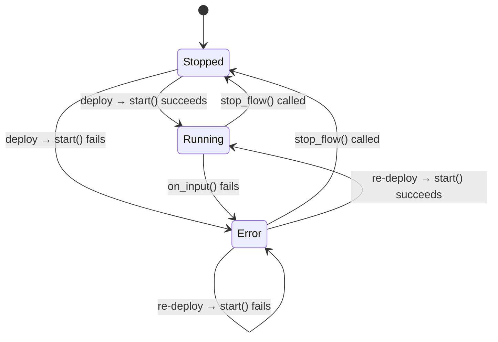

# PlantLink Spec

> **Behavioral Source of Truth** — Defines *what* each module should do.
> See `architecture.md` for *how* it's structured and `GEMINI.md` for operational rules.
>
> **Maintenance Rule**: The Architect must update this file whenever a public API changes.
>
> Last verified against: `94c47ec`

---

## 1. plantlink-core

### Module Contracts

#### `MqttDriver`
**Purpose**: Manages a persistent MQTT client connection and message publishing.

| Method | Signature | Errors | Invariants |
|--------|-----------|--------|------------|
| `connect` | `async fn connect(id: &str, host: &str, port: u16) -> Result<Self>` | Connection failure (network, auth) | Spawns a background event loop task with exponential backoff retry (1s–60s). Never panics on disconnection. |
| `publish` | `async fn publish(&self, topic: &str, payload: Vec<u8>) -> Result<()>` | Publish failure (disconnected, QoS rejection) | Uses `QoS::AtLeastOnce`. |

#### `NatsDriver`
**Purpose**: Manages a NATS client connection with publish/subscribe capabilities.

| Method | Signature | Errors | Invariants |
|--------|-----------|--------|------------|
| `connect` | `async fn connect(url: &str) -> Result<Self>` | Connection failure — wrapped with `"Failed to connect to NATS"` context. | Driver is `Clone`. |
| `publish` | `async fn publish(&self, subject: &str, payload: Bytes) -> Result<()>` | Publish failure — wrapped with `"Failed to publish"` context. | — |
| `subscribe` | `async fn subscribe(&self, subject: &str) -> Result<async_nats::Subscriber>` | Subscribe failure — wrapped with `"Failed to subscribe"` context. | Returns an async stream of messages. |

#### `ModbusTcpClient`
**Purpose**: Reads data from Modbus TCP devices.

| Method | Signature | Errors | Invariants |
|--------|-----------|--------|------------|
| `connect` | `async fn connect(addr: SocketAddr) -> Result<Self>` | TCP connection failure. | — |
| `read_coils` | `async fn read_coils(&mut self, addr: u16, cnt: u16) -> Result<Vec<bool>>` | Modbus protocol error, timeout. | Requires `&mut self` (not thread-safe without external locking). |

### Data Models

#### `DataValue` (enum)
Universal value type for all node payloads.

| Variant | Inner Type | Notes |
|---------|-----------|-------|
| `Boolean` | `bool` | — |
| `Integer` | `i64` | — |
| `Float` | `f64` | — |
| `String` | `String` | — |
| `Bytes` | `Vec<u8>` | — |
| `Json` | `serde_json::Value` | Must be last variant (`#[serde(untagged)]` ordering). |
| `Null` | — | — |

- Implements `Display`, `Clone`, `Serialize`, `Deserialize`.
- **Constraint**: `Json` must remain the last variant to prevent `serde(untagged)` from aggressively capturing other types.

#### `MessagePayload` (struct)
The standard message envelope passed between nodes.

| Field | Type | Required | Default | Constraints |
|-------|------|----------|---------|-------------|
| `id` | `String` | Yes | `Uuid::new_v4()` | Unique per message. |
| `topic` | `Option<String>` | No | `None` | — |
| `payload` | `DataValue` | Yes | `DataValue::Null` | — |
| `timestamp` | `u64` | Yes | `Utc::now().timestamp_millis()` | Milliseconds since epoch. |
| `meta` | `serde_json::Value` | Yes | `{}` | Arbitrary JSON metadata. |

- Implements `Default`, `Clone`, `Serialize`, `Deserialize`.

### Required Test Coverage
- [x] `MessagePayload` serialization round-trip.
- [x] `DataValue` variant ordering (Json last).
- [ ] `MqttDriver` connection and publish (integration).
- [ ] `NatsDriver` pub/sub (integration).
- [ ] `ModbusTcpClient` read_coils (integration).

---

## 2. plantlink-runtime

### Module Contracts

#### `RuntimeEngine`
**Purpose**: Manages the lifecycle of all nodes in a flow.

| Method | Signature | Errors | Invariants |
|--------|-----------|--------|------------|
| `new` | `fn new(tx: broadcast::Sender<SystemEvent>) -> Result<Self>` | Registry lock poisoning. | Calls `register_defaults()` to populate the node registry. |
| `update_flow` | `async fn update_flow(&mut self, flow: FlowConfig) -> Result<()>` | Returns `Err` if any nodes fail to create. | Stops existing flow first, then spawns new nodes. |
| `stop_flow` | `async fn stop_flow(&mut self) -> StopStatus` | Never fails. | Returns count of aborted tasks. |

#### `NodeBehavior` (trait)
**Purpose**: The contract every node type must implement.

| Method | Signature | Default | Errors |
|--------|-----------|---------|--------|
| `start` | `async fn start(&mut self, ctx: NodeContext) -> Result<()>` | `Ok(())` | Node-specific initialization failure. |
| `receive` | `async fn receive(&mut self, port: usize, msg: Arc<MessagePayload>, ctx: NodeContext) -> Result<()>` | Shims to `on_input` | Primary handler. Optimized to avoid payload clones using `Arc`. |
| `on_input` | `async fn on_input(&mut self, port: usize, msg: MessagePayload, ctx: NodeContext) -> Result<()>` | `Ok(())` | [DEPRECATED] Use `receive` instead. |
| `stop` | `async fn stop(&mut self) -> Result<()>` | `Ok(())` | Cleanup failure. |

- Requires `Send + Sync`.

#### `NodeContext`
**Purpose**: Provides output routing and status reporting to node implementations.

| Method | Signature | Notes |
|--------|-----------|-------|
| `send_output` | `async fn send_output(&self, msg: MessagePayload) -> Result<()>` | High-level output send. Wraps `msg` in `Arc` and routes to port 0. |
| `send_output_port` | `async fn send_output_port(&self, port: usize, msg: MessagePayload) -> Result<()>` | Multi-casts the message to all connected target ports without duplicating the payload $O(N)$. |
| `emit_running` | `fn emit_running(&self, message: &str)` | Broadcasts `"running"` status via JSON. |
| `emit_error` | `fn emit_error(&self, message: &str)` | Broadcasts `"error"` status via JSON. |
| `emit_stopped` | `fn emit_stopped(&self, message: &str)` | Broadcasts `"stopped"` status via JSON. |

#### `send_node_status` (utility)
**Purpose**: Constructs and broadcasts a standardized status JSON message.

```
fn send_node_status(tx: &broadcast::Sender<SystemEvent>, node_id: String, state: &str, message: &str)
```
- Wire format: `{ "type": "status", "data": { "node_id": "...", "state": "...", "message": "..." } }`

#### Node Registry
**Purpose**: Dynamic node type creation from string identifiers.

| Function | Signature | Notes |
|----------|-----------|-------|
| `register_node` | `fn register_node(type_name: &str, factory: Fn) -> Result<()>` | Returns error on lock poisoning. |
| `create_node` | `fn create_node(type_name: &str, config: &NodeConfig) -> Result<Box<dyn NodeBehavior>>` | Returns error if type not found. |

**Registered defaults**: `inject`, `console`, `nats-broker`, `nats-sub`, `nats-pub`, `rhai`, `function`, `rhai-function`.

#### Node Communication Patterns

| Pattern | Description | Implementation Details |
|---------|-------------|-------------------------|
| **Shared Resources** | Nodes sharing driver instances (e.g. NATS) | `nats-broker` registers a `PubSubClient` in `ctx.resources`. `nats-sub` and `nats-pub` look up the driver by the broker's ID. |
| **Dynamic Wiring** | Changing node relationships at runtime | `nats-sub` and `nats-pub` accept a new `broker_id` string on port 0 to re-target their connection. |
| **Scripting** | Arbitrary JSON logic | `RhaiNode` converts `MessagePayload` to a Rhai `Dynamic` (Map) for the `process(msg)` user script. |

### Data Models

#### `SystemEvent` (enum)
**Purpose**: Strongly-typed events broadcast over the system message bus to external consumers.

| Variant | Tag | Inner Payload | Notes |
|---------|-----|---------------|-------|
| `Status` | `"status"` | `{ data: NodeStatus }` | Node lifecycle and state changes. |
| `Log` | `"log"` | `{ message: String }` | Free-form console output or diagnostic logs. |

- Serialized with `#[serde(tag = "type", rename_all = "lowercase")]` for direct frontend ingestion.

#### `FlowConfig` (struct)
| Field | Type | Required |
|-------|------|----------|
| `nodes` | `Vec<NodeConfig>` | Yes |
| `edges` | `Vec<EdgeConfig>` | Yes |

#### `NodeConfig` (struct)
| Field | Type | Serde | Notes |
|-------|------|-------|-------|
| `id` | `String` | — | Unique within a flow. |
| `type_` | `String` | `#[serde(rename = "type")]` | Must match a registered node type. |
| `data` | `serde_json::Value` | — | Node-specific configuration. |

#### `EdgeConfig` (struct)
| Field | Type | Required | Default |
|-------|------|----------|---------|
| `id` | `String` | Yes | — |
| `source` | `String` | Yes | — |
| `target` | `String` | Yes | — |
| `source_handle` | `Option<String>` | No | `None` |
| `target_handle` | `Option<String>` | No | `None` |

| Field | Type | Values |
|-------|------|--------|
| `node_id` | `String` | — |
| `state` | `String` | `"running"`, `"error"`, `"stopped"` |
| `message` | `String` | Human-readable description. |
| `tasks_aborted` | `usize` | (In `StopStatus`) Number of tasks aborted. |

### State Machine — Node Lifecycle



| From | To | Trigger | Side Effect |
|------|----|---------|-------------|
| Stopped | Running | `start()` succeeds | `emit_running()` |
| Stopped | Error | `start()` fails | `emit_error()` |
| Running | Stopped | `stop_flow()` | `emit_stopped()`, task aborted |
| Running | Error | `on_input()` error | `emit_error()` (logged) |
| Error | Stopped | `stop_flow()` | `emit_stopped()`, task aborted |
| Error | Running | Re-deploy, `start()` succeeds | `emit_running()` |

### Required Test Coverage
- [x] `send_node_status` serialization.
- [x] `NodeContext::emit_stopped` broadcast.
- [x] `RuntimeEngine::new` returns `Result`.
- [x] `update_flow` returns error on invalid node types.
- [x] `stop_flow` returns `StopStatus` with correct count.
- [x] `InjectNode` timer stops on `CancellationToken` cancellation.
- [x] `InjectNode` timer stops on downstream channel closure.
- [x] `create_node` returns error for unknown type.

---

## 3. plantlink-web

### Module Contracts

#### `WebServer`
**Purpose**: Serves the UI, REST API, and WebSocket connections.

| Method | Signature | Errors | Invariants |
|--------|-----------|--------|------------|
| `run` | `async fn run(port: u16, tx: broadcast::Sender<SystemEvent>, runtime: Arc<RwLock<dyn FlowRuntime>>, stop: impl Future) -> Result<()>` | Bind failure, startup errors. | Spawns a background `EventCache` aggregator. Shuts down when the provided `stop` future completes. |

#### `EventCache` (internal)
**Purpose**: Maintains a live snapshot of node statuses to prevent state-sync drift for WebSocket clients.

- **Sync Policy**: Aggregates `SystemEvent::Status` messages from the broadcast bus.
- **Resilience**: Survives `RecvError::Lagged` by logging the event and resuming the loop.
- **Snapshots**: WebSocket clients receive a full cache snapshot immediately upon connection.
- **Lag Recovery**: WebSocket clients receive a full cache resync if the per-client broadcast channel lags.

### Integration Points

#### REST Endpoints

| Method | Path | Request Body | Response | Status |
|--------|------|-------------|----------|--------|
| `GET` | `/health` | — | `"OK"` | `200` |
| `POST` | `/api/flow` | `FlowConfig` (JSON) | `"Flow Deployed"` / Err string | `200` / `500` |
| `POST` | `/api/flow/stop` | — | `StopStatus` (JSON) | `200` |
| `GET` | `/*` | — | Static asset / SPA fallback | `200` / `404` |

- Static assets support gzip (`Content-Encoding: gzip`) when client sends `Accept-Encoding: gzip`.
- SPA fallback: unknown paths return `index.html`.

#### WebSocket

| Path | Direction | Format |
|------|-----------|--------|
| `/ws` | Server → Client | JSON: `{ "type": "status", "data": { "node_id": "...", "state": "...", "message": "..." } }` |

- One-way broadcast (server pushes to all connected clients).
- No client-to-server messages are processed.

### Required Test Coverage
- [x] `AppState` construction.
- [x] `/health` returns 200.
- [x] `/api/flow` accepts valid `FlowConfig` JSON.
- [ ] `/api/flow` returns 500 on partial failure.
- [x] `/api/flow/stop` stops runtime and returns JSON status.
- [ ] WebSocket receives status broadcasts.
- [ ] SPA fallback serves `index.html` for unknown routes.

---

## 4. plantlink-cli

### Command / CLI Contracts

**Binary**: `plantlink-cli`

| Flag | Short | Type | Default | Description |
|------|-------|------|---------|-------------|
| `--port` | `-p` | `u16` | `3000` | HTTP server listen port. |

### Exit Codes

| Code | Meaning |
|------|---------|
| `0` | Clean shutdown. |
| `1` | Runtime error (e.g., port bind failure). |

### Startup Sequence
1. Initialize `tracing_subscriber`.
2. Parse CLI args.
3. Print version banner.
4. Create broadcast channel (capacity 100).
5. Create `RuntimeEngine`.
6. Call `WebServer::run()`.

### Required Test Coverage
- [x] `--port` flag parsing.
- [x] Default port is 3000.
- [ ] Version banner prints correct version.
